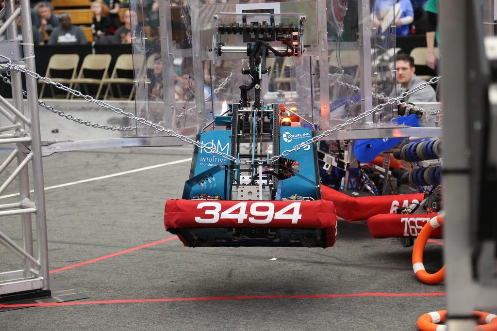

# FRC 3494 Quadrangles 2024 Repo

This is the source code for Cadenza, a robot built by team 3494 for the 2024 FRC Season: Crescendo.

We keep documentation on what hardware and ID's we use, take a look at [hardware.md](./hardware.md)

## Building

- Install WPILib `https://docs.wpilib.org/en/stable/docs/zero-to-robot/step-2/wpilib-setup.html`
- In WPILib VSCode open the command pallet with `ctrl` + `shift` + `p` and run `WPILib: Build Robot Code`

> Note: This generates a file called `src\main\java\frc\robot\BuildConstants.java` that contains info on current Git status for logging purposes, there will be IDE issues until that first build populates the file